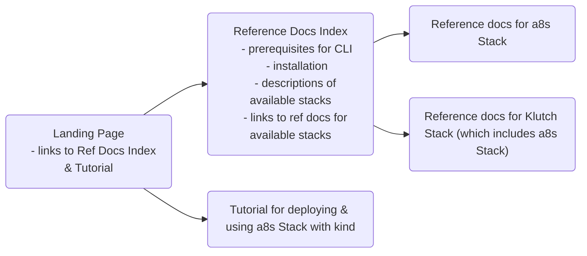
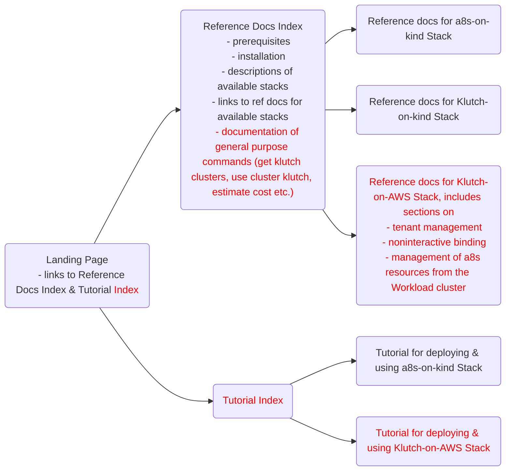
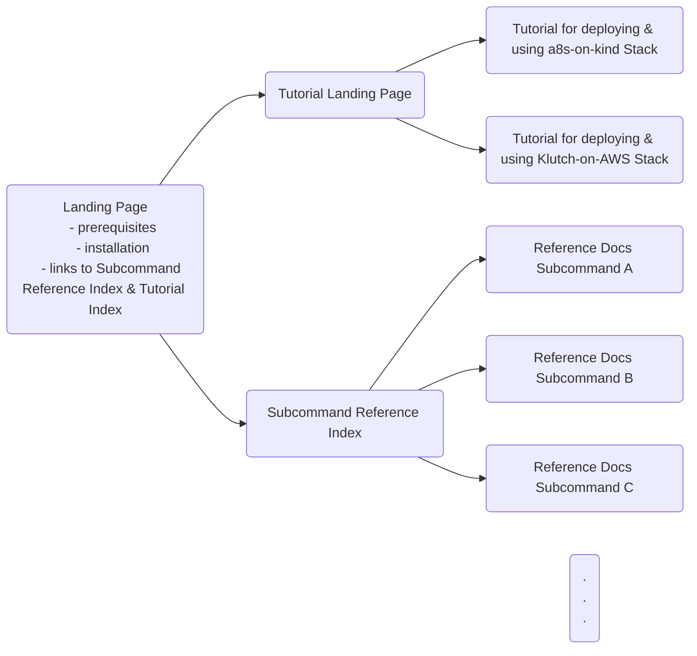

# Develop

* Feature: `create cluster klutch` subcommands for provisioning preconfigured
  EKS control plane and workload clusters (including automated non-interactive
  binding to an existing control plane cluster as part of workload cluster
  creation)
* Feature: Cognito as tenant-aware OIDC provider (including automatic
  bootstrapping and tenant management via a dedicated operator)
* Feature: subcommands for creating, retrieving, listing and deleting Klutch
  tenants
* Feature: managing public hosted zones for control plane clusters to expose
  their `klutch-bind` backends (including DNS resolution verification and ACM
  certificate provisioning)
* Feature: `delete cluster klutch` subcommands for deleting EKS control plane
  and workload clusters (including cleanup of related AWS resources)
* Feature: subcommands for installing the Klutch control plane components into
  an existing EKS cluster and for removing them again
* Feature: subcommands for creating and deleting Klutch-managed PostgreSQL
  resources
* Feature: subcommand `bind klutch workload` for binding an existing EKS
  workload cluster to a Klutch control plane
* Feature: `estimate-cost` subcommand for gauging the hourly and monthly cost of
  an EKS cluster with a specified configuration
* Feature: subcommands for listing Klutch clusters in the current Kubeconfig and
  for connecting to them
* Feature: support for non-interactive binding via `klutch-bind`
* Feature: dry-run mode for `bind klutch workload`, `create cluster klutch` and
  `delete cluster klutch`
* Bugfix: `create cluster`: waiting for Minio readiness

# Changes
## main
### commands
#### cluster
##### pwd
#### completion
##### bash
##### fish
##### powershell
##### zsh
#### create
##### cluster
###### a8s
##### pg
###### backup
###### instance
###### restore
###### servicebinding
##### stack
###### a8s
#### help
##### ...
#### delete
##### cluster
###### a8s
##### pg
###### instance
###### servicebinding
#### klutch
##### bind
##### delete
##### deploy
#### pg
##### apply
#### version
## feature-klutch-aws-install
### commands
#### apply
##### klutch
###### control-plane
Install the Klutch control plane onto the current Kubernetes cluster.
#### bind
##### klutch
###### workload
Bind a workload cluster to a Klutch control plane.
#### create
##### cluster
###### klutch
####### control-plane
Create an EKS cluster and install the control plane components on it
####### tenant
Creates a Klutch tenant by applying a Tenant CR to the control-plane cluster (reconciled by the tenant operator).
####### workload
Create an EKS cluster and binds it to a control plane
##### klutch
###### pg
####### backup
Creates a Klutch-managed PostgreSQL backup claim
####### instance
Creates a Klutch-managed PostgreSQL instance claim
####### restore
Creates a Klutch-managed PostgreSQL restore claim
####### servicebinding
Creates a Klutch-managed PostgreSQL servicebinding claim
###### tenant
Creates a Klutch tenant by applying a Tenant CR to the control-plane cluster (reconciled by the tenant operator).
#### delete
##### cluster
###### klutch
####### control-plane
Delete an EKS control plane cluster the related resources
####### workload
Delete an EKS workload cluster the related resources
##### klutch
###### control-plane
Undeploy the control plane components from the current Kubernetes cluster
###### pg
####### backup
Deletes a Klutch-managed PostgreSQL backup claim
####### instance
Deletes a Klutch-managed PostgreSQL instance claim
####### restore
Deletes a Klutch-managed PostgreSQL restore claim
####### servicebinding
Deletes a Klutch-managed PostgreSQL servicebinding claim
##### tenant
Deletes the credentials secret for a Klutch tenant
#### estimate-cost
##### cluster
###### klutch
Estimates the hourly and monthly cost for an EKS cluster
#### get
##### clusters
###### klutch
Lists Klutch clusters found in the current Kubeconfig
##### klutch
###### clusters
Lists Klutch clusters found in the current Kubeconfig
###### tenant
Displays the contents of the credentials secret for a Klutch tenant
###### tenants
Lists Klutch tenants found in the current AWS Account
#### use
##### cluster
###### klutch
Connect to specified Klutch cluster
##### klutch
Connect to specified Klutch cluster
### functions
#### granular
* Install the Klutch control plane onto the current EKS cluster
  * `a9s apply klutch control-plane`
* Bind an EKS workload cluster to a Klutch control plane.
  * `a9s bind klutch workload`
* Create an EKS cluster and install the control plane components on it
  * `a9s create cluster klutch control-plane`
* Create an EKS cluster and binds it to a control plane
  * `a9s create klutch workload`
* Create a Klutch-managed PostgreSQL instance claim
  * `a9s create klutch pg instance --name <instance-name>`
* Creates a Klutch-managed PostgreSQL servicebinding claim
  * `a9s create klutch pg servicebinding --name <servicebinding-name>
    --service-instance <instance-name>`
* Create a Klutch-managed PostgreSQL backup claim
  * `a9s create klutch pg backup --name <backup-name> --service-instance
    <instance-name>`
* Creates a Klutch-managed PostgreSQL restore claim
  * `a9s create klutch pg restore --name <restore-name> --backup <backup-name>
    --service-instance <target-instance-name>`
* Creates a Klutch tenant by applying a Tenant CR to the control-plane cluster (reconciled by the tenant operator)
  * `a9s create cluster klutch tenant --tenant-name <tenant-name>`
  * `a9s create klutch tenant --tenant-name <tenant-name>`
* Delete an EKS control plane cluster the related resources
  * `a9s delete cluster klutch control-plane`
* Delete an EKS workload cluster the related resources
  * `a9s delete cluster klutch workload --cluster-name <cluster-name>`
* Undeploy the control plane components from the current Kubernetes cluster
  * `a9s delete klutch control-plane`
* Deletes a Klutch-managed PostgreSQL backup claim
  * `a9s delete klutch pg backup --name <backup-name>`
* Deletes a Klutch-managed PostgreSQL instance claim
  * `a9s delete klutch pg instance --name <instance-name>`
* Deletes a Klutch-managed PostgreSQL restore claim
  * `a9s delete klutch pg restore --name <restore-name>`
* Deletes a Klutch-managed PostgreSQL servicebinding claim
  * `a9s delete klutch pg servicebinding --name <servicebinding-name>`
* Deletes the credentials secret for a Klutch tenant
  * `a9s delete tenant <tenant-name>`
* Estimates the hourly and monthly cost for an EKS cluster
  * `a9s estimate-cost cluster klutch`
* Lists Klutch clusters found in the current Kubeconfig
  * `a9s get clusters klutch`
  * `a9s get klutch clusters`
* Displays the contents of the credentials secret for a Klutch tenant
  * `a9s get tenant <tenant-name>`
* Lists Klutch tenants found in the current AWS Account
  * `a9s get tenants`
* Connect to specified Klutch cluster
  * `a9s use klutch --cluster-name <cluster-name>`
  * `a9s use cluster klutch --cluster-name <cluster-name>`
#### compressed
* Create and delete EKS clusters preconfigured for Klutch (including cleanup of
  related AWS resources)
  * `a9s create cluster klutch control-plane -p aws`
  * `a9s create klutch workload -p aws`
  * `a9s delete cluster klutch control-plane -p aws`
  * `a9s delete cluster klutch workload -p aws --cluster-name <cluster-name>`
* Create, retrieve, list and delete Klutch tenants
  * `a9s create klutch tenant --tenant-name <tenant-name>`
    `a9s create cluster klutch tenant --tenant-name <tenant-name>`
  * `a9s get tenants`
  * `a9s get tenant <tenant-name>`
  * `a9s delete tenant <tenant-name>`
* Create and delete Klutch-managed PostgreSQL resources
  * `a9s create klutch pg instance --name <instance-name>`
  * `a9s create klutch pg servicebinding --name <servicebinding-name>
    --service-instance <instance-name>`
  * `a9s create klutch pg backup --name <backup-name> --service-instance
    <instance-name>`
  * `a9s create klutch pg restore --name <restore-name> --backup <backup-name>
    --service-instance <target-instance-name>`
  * `a9s delete klutch pg backup --name <backup-name>`
  * `a9s delete klutch pg instance --name <instance-name>`
  * `a9s delete klutch pg restore --name <restore-name>`
  * `a9s delete klutch pg servicebinding --name <servicebinding-name>`
* Install the Klutch control plane an existing EKS cluster or undeploy it
  * `a9s apply klutch control-plane`
  * `a9s delete klutch control-plane`
* Bind an existing EKS workload cluster to a Klutch control plane.
  * `a9s bind klutch workload`
* Estimate the hourly and monthly cost for an EKS cluster
  * `a9s estimate-cost cluster klutch`
* List Klutch clusters found in the current Kubeconfig and use them
  * `a9s get clusters klutch`
    `a9s get klutch clusters`
  * `a9s use klutch --cluster-name <cluster-name>`
    `a9s use cluster klutch --cluster-name <cluster-name>`
* Bugfix: `a9s create cluster`: waiting for Minio readiness

# CLI Docs Structure

Currently the CLI docs don't have a navigation bar on the side like the other documentations do. So
I chose to express their strucutre as a flowchart, since a user can't jump between these pages
without using the search function.
The red text marks the changes I'm proposing to incorporate documentation for the new version.

## Current Structure

## Proposed Short-Term update

## Proposed Long-term Overhaul

